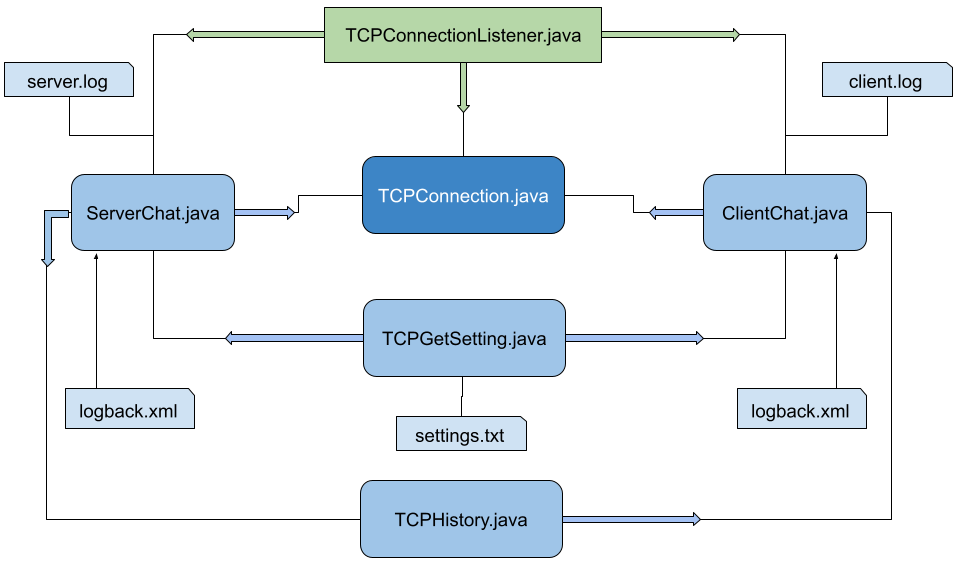

# Курсовая работа "Сетевой чат"

## Общая схема работы программы

## Описание файлов и методов

[**network_chat**]() , [**server**](server), [**client**](client) - основные модули программы.
[**server**](server), [**client**](client) зависят от модуля [**network_chat**](). Зависимости прописаны 
у каждого в своем `pom.xml`.

### TCPConnection.java

Основной универсальный класс `ТСР` соединений. Использует реализацию методов из интерфейса `TCPConnectionListener`.
Создается два конструктора в классе:

* первый конструктор принимает уже созданный на стороне `Socket`;
* второй конструктор создает новый `Socket` по переданным параметрам.

В перегруженном конструкторе объекта создается основной поток, который слушает входящее соединение, если произошло
соединения генерируется соответствующее событие.

* `onConnectionReady()` - событие на соединение;
* `onReceiveStrings()` - событие на принятия строки;
* `onException()` - событие на исключения;
* `onDisconnect()` - событие на отключения.

В объекте класса реализовано два потокобезопасных метода:

* `send()` - отправка строки;
* `disconnect()` - когда необходимо "снаружи" прервать поток.

### TCPConnectionListener.java

Интерфейс. Описывает следующие методы:

* `onConnectionReady()` - событие на соединение;
* `onReceiveStrings()` - событие на принятия строки;
* `onException()` - событие на исключения;
* `onDisconnect()` - событие на отключения.

### TCPGetSetting.java

Получение настроек из файла `setting.txt` - информация в котором представлена как ключ/значение.
Получаем номер порта, и `host` для соединения. Используют объекты классов: `ClientChat`,`ServerChat`.

* `getValue()` - возвращает ключ из файла, по переданному значению.

### TCPHistory.java

Объект класса для хранения истории переписки. Реализовано два потокобезопасных метода:

* `addStory()` - сохранения истории переписки, каждая 10 (задается) запись удаляет первое сообщение из истории;
* `printHistory()` - печатает в консоль последних 10 сообщений(задается).

Данный объект класса реализуется в объекте класса `ServerChat`.

### ServerChat.java

Класс отвечающий за создание сервера. Внутри создается объект `ServerSocket` который слушает порт, и принимает
входящее соединения. Настройки сервера, получаем из файла `setting.txt` считывания данных занимается объект
класса `TCPGetSetting`. На каждое новое соединения создается новый поток из`TCPConnection` которому передается
готовый `socket` и слушатель `TCPConnectionListener` в данном случаи класс `ServerChat`. Методы
интерфейса `TCPConnectionListener` реализуются в данном классе:

* `onConnectionReady()` - при соединении нового клиента, `Socket`  сохраняется в списке соединений с помощью
  класса `ArrayList` из TCP соединений. Текущему соединению отправляется история переписки, отвечает за это `TCPHistory`
  ;
* `onReceiveStrings()` - при поступлении входящего сообщения, сервер пересылает сообщения всем своим
  активным соединениям из списка `ArrayList`. В случаи поступлении строки `/exit` сервер удаляет из
  своего списка текущее TCP соединения;
* `onDisconnect()` - удаления из списка текущего соединения;
* `onException()` - при возникновении исключений, сообщение выводится в консоль и информация
  сохраняется в файл логирования `server.log`.

Все логи записываются в файл: [**server.log**](client/logs/server.log). В котором содержится история важных событий
программы и история переписки всех пользователей. Для логирования использовалась
связка `logback` + `slf4j`. Зависимость прописывается в [pom.xml](pom.xml). Выводится три уровня событий важности:

* INFO - переписка клиентов;
* DEBUG - логи для отладки приложений;
* ERROR - критические ошибки в программе.

Настройки логирования описаны в файле [**logback.xml**](server/src/main/resources/logback.xml) в каталоге `resources`. Когда
размер [**server.log**](client/logs/client.log) превышает
заданного критерия - 1Mb, создается архив в каталоге `*./archived`. Когда общий размер всех архивов превысит 10Mb
старый файл будет удален. Если архиву больше 60 дней он также будет удален.

### ClientChat.java

Класс отвечающий за создание клиента. Создается новое соединение TCPConnection, создается новый сокет с указанием порта
и ip адреса.
Настройки клиента, получаем из файла `setting.txt` считывания данных занимается объект класса `TCPGetSetting`.
Пользователю
предлагается ввести ***nickname*** в консоли, за это отвечает метод `inputNickname()`. В данном объекте класса создаются
два потока:

* **первый** - слушает сообщения, создается в `TCPConnection`;
* **второй** - он же базовый, отправляет сообщения серверу, создается в текущем классе `ClientChat`

Методы интерфейса `TCPConnectionListener` реализуются в данном классе:

* onConnectionReady() - при соединении, отправляется данные серверу о клиенте;
* onReceiveStrings() - при поступлении входящего сообщения информация выводится в консоль пользователю.
* onDisconnect() - выводится информация в консоль о закрытии соединения;
* onException() - при возникновении исключений, сообщение выводится в консоль и информация
  сохраняется в файл логирования `server.log`.

Все логи записываются в файл: [**client.log**](client/logs/client.log). В котором содержится история важных событий
программы и история переписки всех пользователей. Для логирования использовалась
связка `logback` + `slf4j`. Зависимость прописывается в [pom.xml](pom.xml). Выводится три уровня событий важности:

* INFO - переписка текущего клиента;
* DEBUG - логи для отладки;
* ERROR - критические ошибки возникающие в программе.

Настройки логирования описаны в файле [**logback.xml**](client/src/main/resources/logback.xml) в каталоге `resources`. Когда
размер [**client.log**](client/logs/client.log) превышает
заданного критерия - 1Mb, создается архив в каталоге `*./archived`. Когда общий размер всех архивов превысит 10Mb
старый файл будет удален. Если архиву больше 60 дней он также будет удален.

